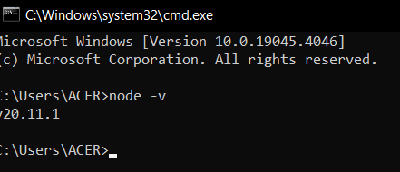
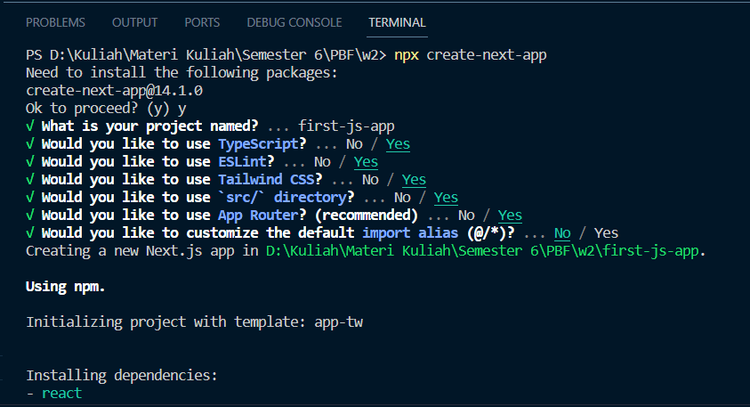
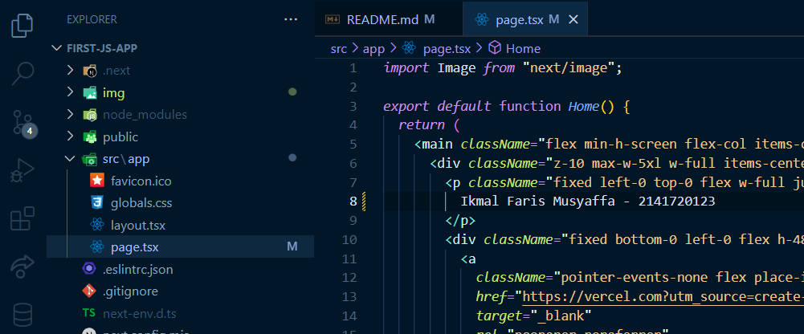
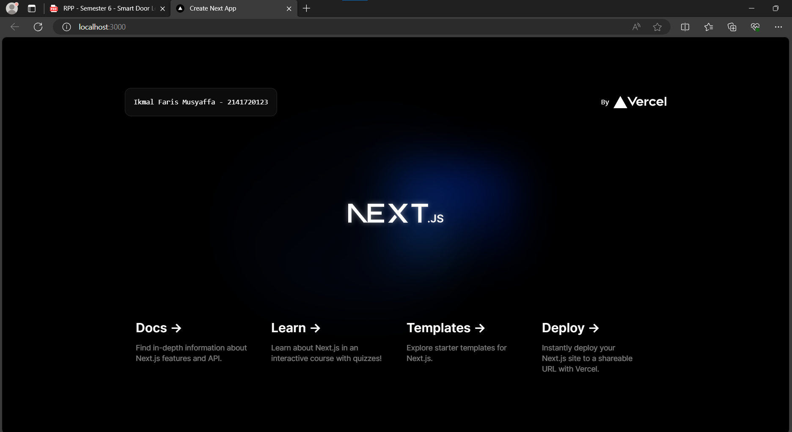
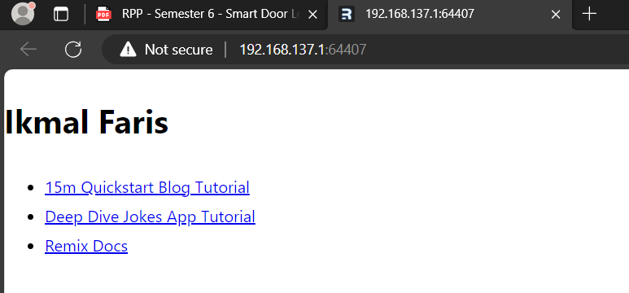
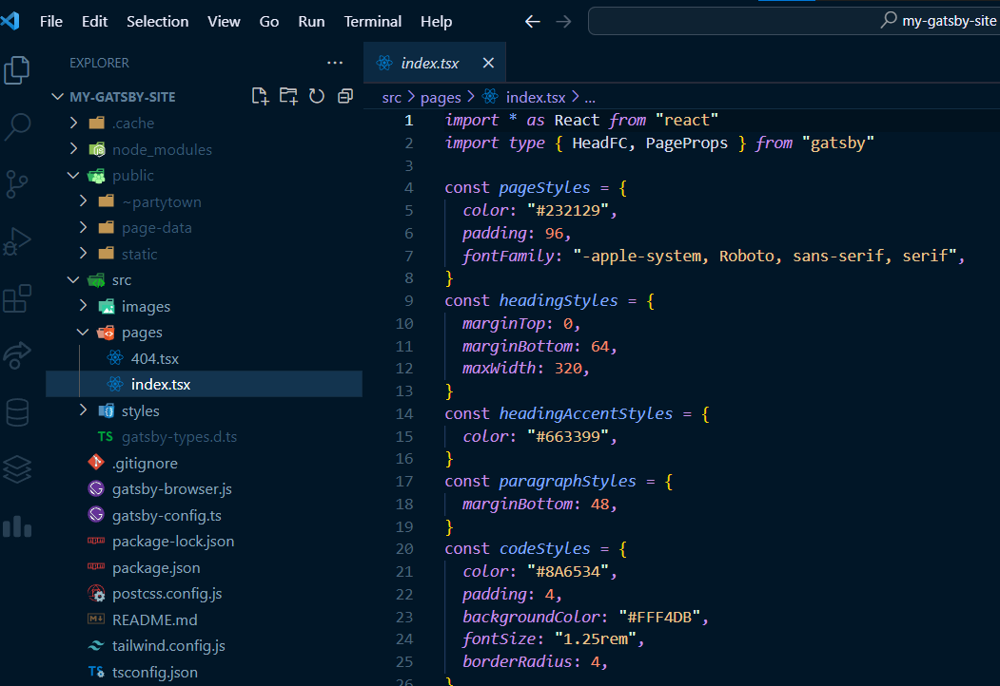
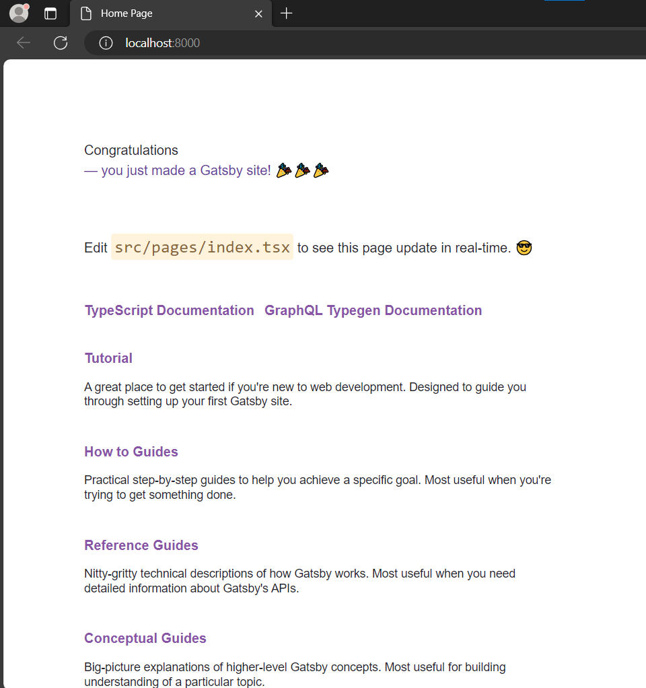

# Ikmal Faris Musyaffa
# 2141720123 / 06 / TI-3C
# Laporan Parktikum 2

## Menjawab Soal

### Soal 1

TypeScript adalah bahasa pemrograman tingkat tinggi sumber terbuka dan gratis yang dikembangkan oleh Microsoft yang menambahkan pengetikan statis dengan anotasi tipe opsional ke JavaScript. Ini dirancang untuk pengembangan aplikasi besar dan transpile ke JavaScript. Wikipedia (Inggris)

ESLint adalah alat analisis kode statis untuk mengidentifikasi pola bermasalah yang ditemukan dalam kode JavaScript. Itu dibuat oleh Nicholas C. Zakas pada tahun 2013. Aturan di ESLint dapat dikonfigurasi, dan aturan yang disesuaikan dapat ditentukan dan dimuat. Wikipedia (Inggris)

Tailwind CSS adalah kerangka kerja CSS yang di dalamnya terdapat sekumpulan utility classes untuk membangun antarmuka kustom dengan cepat. Tailwind CSS berbeda dengan kerangka kerja CSS seperti Bootstrap, Bulma, atau Foundation, karena Tailwind CSS bukan sebuah UI Framework. Wikipedia

Router app adalah sebuah sistem yang memungkinkan navigasi antar halaman dalam sebuah aplikasi web. Sistem ini memetakan URL ke komponen React yang akan ditampilkan.

Import alias adalah sebuah fitur dalam bahasa pemrograman yang memungkinkan Anda untuk memberi nama baru pada modul atau variabel yang diimport. contoh
```bash
import math as mathjs from "math";
import utils from "utils";
```

### Soal 2

.git: Folder ini berisi file-file yang terkait dengan Git, sistem kontrol versi yang digunakan untuk melacak perubahan pada project.

node_modules: Folder ini berisi modul-modul Node.js yang digunakan oleh project. Modul-modul ini diinstal menggunakan npm atau Yarn.

public: Folder ini berisi file-file statis yang akan disajikan langsung ke browser, seperti gambar, CSS, dan JavaScript.

src: Folder ini berisi kode sumber project.
File:

.eslintrc.json: File ini berisi konfigurasi untuk ESLint, alat yang membantu untuk menemukan dan memperbaiki kesalahan kode.

.gitignore: File ini berisi daftar file yang tidak ingin dilacak oleh Git.
next.config.mjs: File ini berisi konfigurasi untuk Next.js, framework React yang digunakan untuk membangun aplikasi web.

next-env.d.ts: File ini berisi deklarasi tipe untuk variabel lingkungan yang digunakan oleh Next.js.

package.json: File ini berisi informasi tentang project, seperti nama, versi, dan dependensi.

package-lock.json: File ini berisi daftar modul Node.js yang diinstal untuk project, beserta versi spesifiknya.

postcss.config.js: File ini berisi konfigurasi untuk PostCSS, alat yang digunakan untuk memproses CSS.

README.md: File ini berisi README project, yang berisi informasi tentang project, seperti cara instalasi dan cara penggunaan.

tailwind.config.ts: File ini berisi konfigurasi untuk Tailwind CSS, framework CSS yang digunakan untuk membangun UI aplikasi web.

tsconfig.json: File ini berisi konfigurasi untuk TypeScript, superset dari JavaScript yang menambahkan fitur seperti tipe data dan static typing.

## Langkah-langkah membuat project

### 1. Cek versi node js


### 2. Gunakan perintah di bawah


### 3. Edit page.tsx pada src/app, ganti dengan nama - nim


### 4. Jalankan 'npm run dev' pada terminal lalu buka


### Soal 3

Next Js tidak perlu mereload halaman untuk melihat perubahan karena memiliki fitur berikut:

1. Hot Module Replacement (HMR)

HMR memungkinkan Anda untuk melihat perubahan pada kode Anda secara real-time tanpa perlu memuat ulang seluruh halaman. Ketika Anda mengubah kode, HMR hanya memuat ulang modul yang diubah, sehingga sisa halaman tidak terpengaruh.

2. Server-Side Rendering (SSR)

SSR memungkinkan Next.js untuk merender HTML, CSS, dan JavaScript di server sebelum dikirim ke browser. Hal ini berarti bahwa browser tidak perlu merender seluruh halaman dari awal, yang dapat mempercepat waktu loading.

3. Static Site Generation (SSG)

SSG memungkinkan Next.js untuk membuat situs web statis yang dapat dihosting di CDN (Content Delivery Network). CDN adalah jaringan server yang didistribusikan di seluruh dunia, yang dapat membantu meningkatkan performa dan skalabilitas situs web.

4. Automatic Code Splitting

Next.js secara otomatis membagi kode aplikasi Anda menjadi beberapa bundle yang terpisah. Hal ini memungkinkan browser untuk hanya memuat kode yang diperlukan untuk halaman yang sedang ditampilkan, yang dapat meningkatkan performa dan menghemat bandwidth.

# Tugas Praktikum

# Remix

### Berikut adalah tampilan isi project dari remix


### Berikut adalah tampilan awal remix project



### Remix terlihat lebih simpel dan lebih ringan. Folder dalam project juga lebih sedikit daripada next.js untuk performa masih belum bisa dibuktikan

# Gatsby

### Berikut adalah tampilan isi project dari gatsby



### Berikut adalah tampilan awal gatsby project



### Gatsby terlihat lebih kompleks dalam instalasi karena harus menginstal gatsby cli. Gatsby terlihat hampir sama dengan remix yang minim file dan lebih sederhana, tetapi tampilan lebih simpel remix dan saya percaya bahwa remix lebih ringan. css dari gatsby juga jadi satu dengan index tsx.